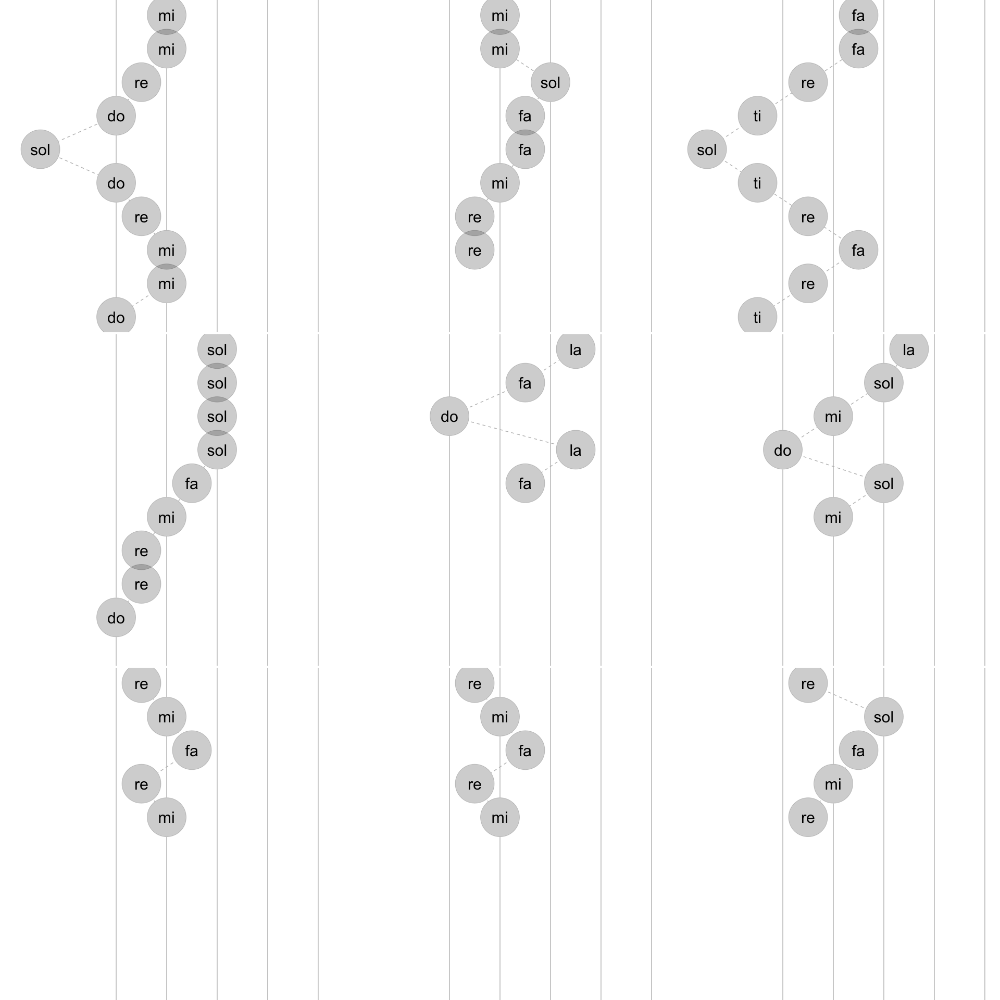
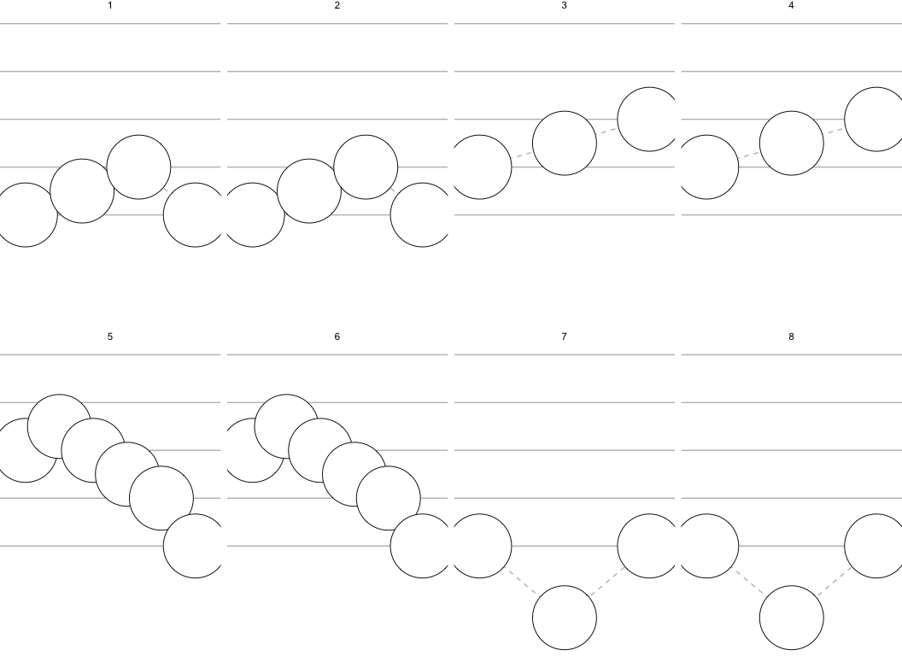
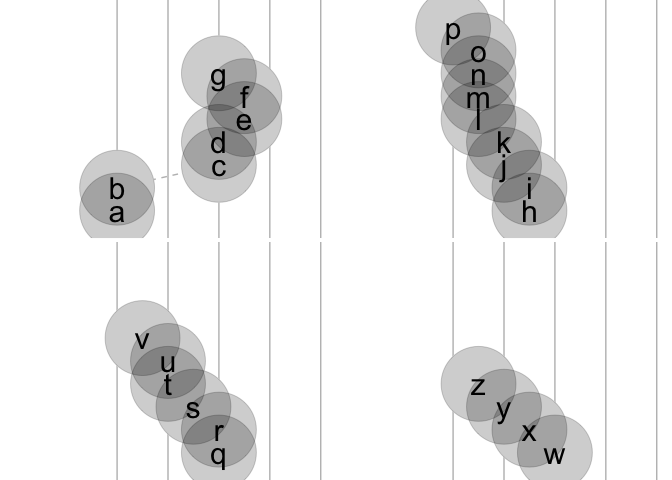
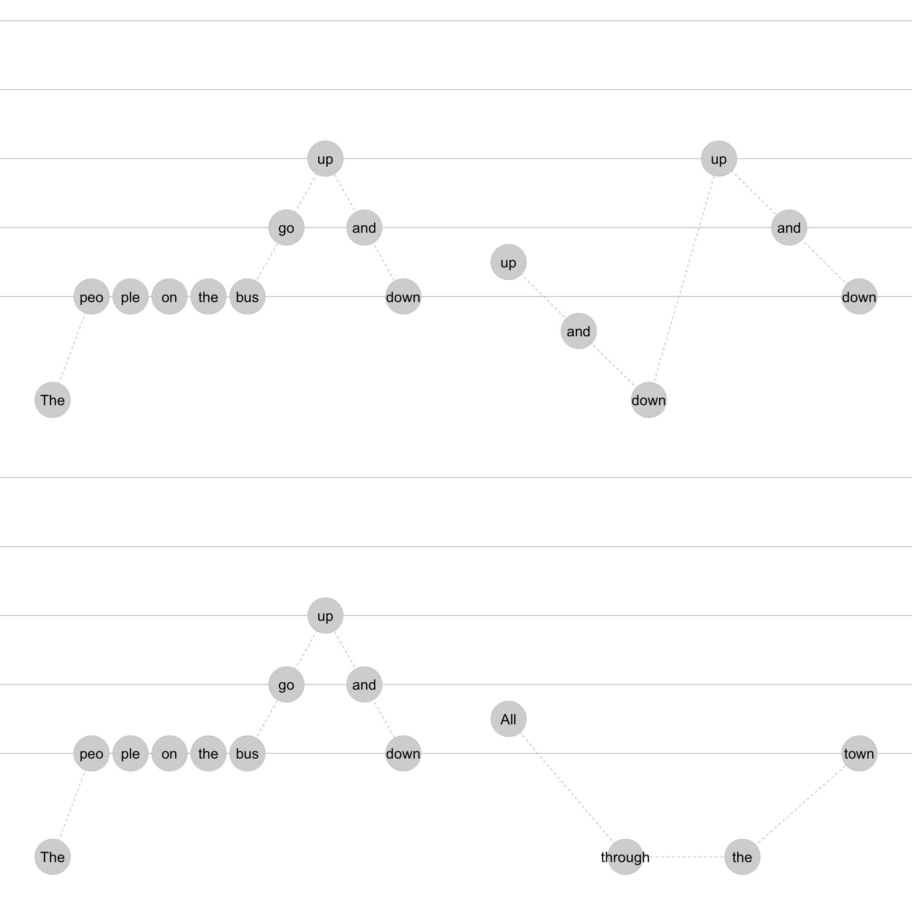
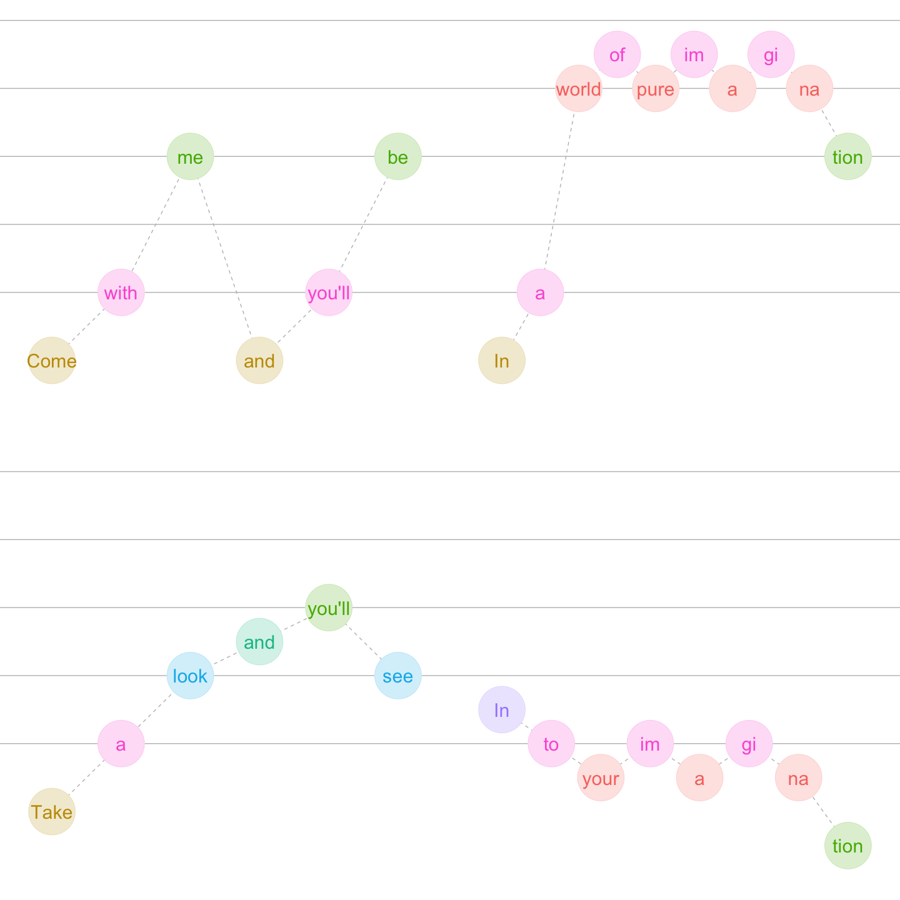
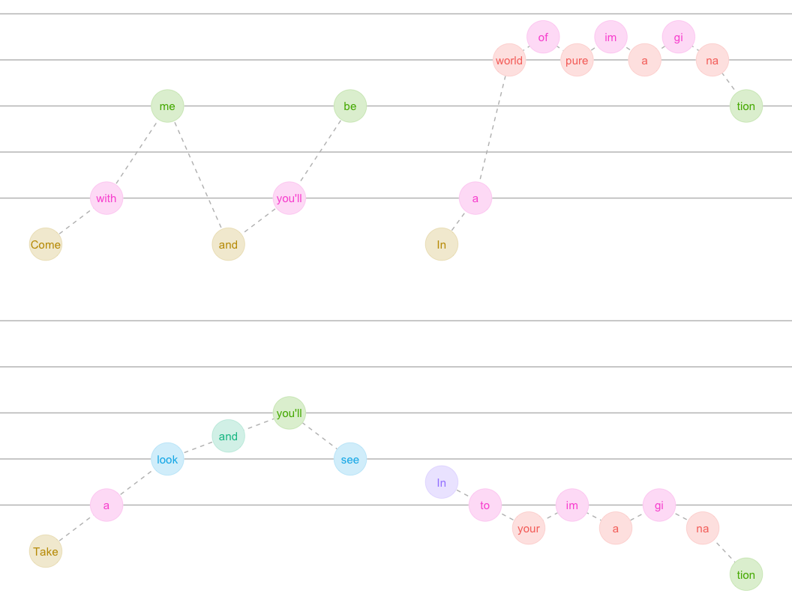

<!-- README.md is generated from README.Rmd. Please edit that file -->

# ggdoremi

Melodies can be input using short hand do re mi. Three octaves may be
input using the following short hand: DRMFSLTdrmfslt12345678.

This can be linked up with lyrics (modified if they span multiple notes)
and we’re thinking about durations.

“1ena2ena3ena4ena1nn3nn4nn5nn6nn7nn8nn9”

“1-23-45-67-8”

<!-- badges: start -->

<!-- badges: end -->

The goal of ggdoremi is to …

``` r

return_drm_3octaves <- function(){
  
drm3 <- c("D", "R", "M", "F", "S", "L", "T", 
  "d", "r", "m", "f", "s", "l", "t", 
  "1", "2", "3", "4", "5", "6", "7", "8")
    
factor(drm3, levels = drm3)
    
  
}

return_rel_freq_1octave <- function(){
  
  c(1, 9/8, 81/64,4/3, 3/2, 27/16, 243/128)
  
}

return_rel_freq_3octave <- function(){
  
  multiplier1octave <- return_rel_freq_1octave()
  
  c(multiplier1octave/2, multiplier1octave, multiplier1octave*2, 4)
  
}

return_drm_df <- function(base_freq = 311.127){  #E above middle C
  
  data.frame(drm = return_drm_3octaves(),
             doremi = c(rep(c("do", "re", "mi", "fa", "sol", "la", "ti"), 3), "do") %>% forcats::fct_inorder(),
             freq = base_freq*return_rel_freq_3octave())
  
}
```

``` r
return_drm_df()
#>    drm doremi      freq
#> 1    D     do  155.5635
#> 2    R     re  175.0089
#> 3    M     mi  196.8851
#> 4    F     fa  207.4180
#> 5    S    sol  233.3453
#> 6    L     la  262.5134
#> 7    T     ti  295.3276
#> 8    d     do  311.1270
#> 9    r     re  350.0179
#> 10   m     mi  393.7701
#> 11   f     fa  414.8360
#> 12   s    sol  466.6905
#> 13   l     la  525.0268
#> 14   t     ti  590.6552
#> 15   1     do  622.2540
#> 16   2     re  700.0358
#> 17   3     mi  787.5402
#> 18   4     fa  829.6720
#> 19   5    sol  933.3810
#> 20   6     la 1050.0536
#> 21   7     ti 1181.3103
#> 22   8     do 1244.5080
```

``` r
return_phrases_lyrics_baby_beluga <- function(){
"Ba-by Be-lu-ga in the deep blue sea
Swim so wild and you swim so free,
heav-en ab-o-ove and the sea be-low,
just a lit-tle white whale on the go,
Ba-by Be-lu-ga,
Oh Ba-by Be-lu-ga,
Is the wa-ter warm, 
is your ma-ma home,
with you so hap-py"
}

return_phrases_drm_baby_beluga <- function(){
  
"mmrdSdrmmd mmsffmrr 
ffrTSTrfrT ssssfmrrd 
lfdlf lsmdsm 
rmfrm rmfrm rsfmr"
  
}

parse_phrases_drm <- function(drm_phrases = return_phrases_drm_baby_beluga(), base_freq = 440){
  
  levels <- return_drm_3octaves()
  
  drm_phrases <- strsplit(drm_phrases,  "\\s+")[[1]]
  
  data.frame(sung_notes = drm_phrases) |> 
  tibble::tibble() |> 
  dplyr::mutate(id_phrase = dplyr::row_number()) |> 
  dplyr::mutate(sung_notes_parsed = stringr::str_split(sung_notes, "")) |> 
  tidyr::unnest(cols = c(sung_notes_parsed)) |> 
  dplyr::mutate(sung_notes_parsed = factor(sung_notes_parsed, levels)) |> 
  dplyr::group_by(id_phrase) |> 
  dplyr::mutate(id_in_phrase = dplyr::row_number()) |>
  dplyr::select(id_phrase, id_in_phrase, drm = sung_notes_parsed) |> 
  dplyr::left_join(return_drm_df(base_freq = base_freq))
  
}

parse_phrases_lyrics <- function(lyrics_phrases){
  
    lyrics_phrases <- strsplit(lyrics_phrases,  "\\n")[[1]]
  
  tibble::tibble(words = lyrics_phrases) |> 
  dplyr::mutate(id_phrase = dplyr::row_number()) |> 
  dplyr::mutate(words_parsed = stringr::str_split(words, " |-")) |> 
  tidyr::unnest(cols = c(words_parsed)) |> 
  dplyr::group_by(id_phrase) |> 
  dplyr::mutate(id_in_phrase = dplyr::row_number()) |>
  dplyr::select(id_phrase, id_in_phrase, lyric = words_parsed)
  
}
```

``` r
return_phrases_drm_baby_beluga() |> 
  parse_phrases_drm()
#> Joining with `by = join_by(drm)`
#> # A tibble: 63 × 5
#> # Groups:   id_phrase [9]
#>    id_phrase id_in_phrase drm   doremi  freq
#>        <int>        <int> <fct> <fct>  <dbl>
#>  1         1            1 m     mi      557.
#>  2         1            2 m     mi      557.
#>  3         1            3 r     re      495 
#>  4         1            4 d     do      440 
#>  5         1            5 S     sol     330 
#>  6         1            6 d     do      440 
#>  7         1            7 r     re      495 
#>  8         1            8 m     mi      557.
#>  9         1            9 m     mi      557.
#> 10         1           10 d     do      440 
#> # ℹ 53 more rows

return_phrases_lyrics_baby_beluga() |> 
  parse_phrases_lyrics()
#> # A tibble: 64 × 3
#> # Groups:   id_phrase [9]
#>    id_phrase id_in_phrase lyric
#>        <int>        <int> <chr>
#>  1         1            1 Ba   
#>  2         1            2 by   
#>  3         1            3 Be   
#>  4         1            4 lu   
#>  5         1            5 ga   
#>  6         1            6 in   
#>  7         1            7 the  
#>  8         1            8 deep 
#>  9         1            9 blue 
#> 10         1           10 sea  
#> # ℹ 54 more rows
```

``` r
join_phrases_drm_lyrics <- function(drm_phrases = return_phrases_drm_baby_beluga(), 
                                    lyrics_phrases = return_phrases_lyrics_baby_beluga()){
 
  dplyr::full_join(parse_phrases_drm(drm_phrases),
                   parse_phrases_lyrics(lyrics_phrases))
  
}

return_df_drm_baby_beluga <- function(){
  
  
  join_phrases_drm_lyrics(
  drm_phrases = return_phrases_drm_baby_beluga(), 
  lyrics_phrases = return_phrases_lyrics_baby_beluga() 
  )
  
}
```

``` r
return_rhythm_baby_beluga <- function(){ 
  
      rhythm <-     "12a3a4a12341234a123412a3a4a12a34a1a234a1234"
ind_voiced   <-     "1111111111011111111011111111011111111111000"
    measure <-      "1111111222233333444455555556666666777778888"    
beat_in_measure  <- "12233441234123441234122334412a3441123441234"
 
data.frame(rhythm, measure, beat_in_measure, ind_voiced)

  }

# time_span <- function(num_measures = 12){
#   
# measure <- c( "1" ,"e", "n", "a", "2", "e",
#  "n" ,"a", "3", "e", "n", "a",
#  "4" ,"e", "n", "a")
#   
# time_frame <- 1:(length(measure)*num_measures)
# 
# data.frame(time_frame,
# time_frame_element = rep(measure, num_measures))
# 
# }


# time_span() |> dplyr::bind_cols(data.frame(rythm=return_rythem_baby_beluga()))
```

``` r
join_phrases_drm_lyrics(
  drm_phrases = return_phrases_drm_baby_beluga(), 
  lyrics_phrases = return_phrases_lyrics_baby_beluga() 
  )
#> Joining with `by = join_by(drm)`
#> Joining with `by = join_by(id_phrase, id_in_phrase)`
#> # A tibble: 64 × 6
#> # Groups:   id_phrase [9]
#>    id_phrase id_in_phrase drm   doremi  freq lyric
#>        <int>        <int> <fct> <fct>  <dbl> <chr>
#>  1         1            1 m     mi      557. Ba   
#>  2         1            2 m     mi      557. by   
#>  3         1            3 r     re      495  Be   
#>  4         1            4 d     do      440  lu   
#>  5         1            5 S     sol     330  ga   
#>  6         1            6 d     do      440  in   
#>  7         1            7 r     re      495  the  
#>  8         1            8 m     mi      557. deep 
#>  9         1            9 m     mi      557. blue 
#> 10         1           10 d     do      440  sea  
#> # ℹ 54 more rows
```

``` r
aes_drm <- function(){
  
    ggplot2::aes(x = id_in_phrase, y = as.numeric(drm))
  
}


scale_xy_drm <- function(y_limits = c(4, 16)){
  
  list(ggplot2::scale_y_continuous(limits = y_limits),
  ggplot2::scale_x_continuous(
    expand = ggplot2::expansion(mult = c(.15, .15))))
                                
}

facet_drm <- function(ncol = 2){
  
  facet_wrap(~ id_phrase, ncol = ncol, scales = "free_x")
  
}


stamp_drm_staff <- function(color = "grey"){
  
    geom_hline(yintercept = c(8,10,12,14,16), color = color)
  
}

geom_note_link <- function(linetype = "dashed", color = "gray"){
  
  geom_line(linetype = linetype, color = color)
  
}


geom_note <- function(alpha = .2, size = 26, shape = 19, ...){
  
  list(ggplot2::geom_point(alpha = 1, size = size, shape = shape, fill = "white", color = "white", ...),
  ggplot2::geom_point(alpha = alpha, size = size, shape = shape, ...)
  )
  
}

geom_lyric <- function(size = 8){
  
  ggplot2::geom_text(aes(label = lyric), size = size)
  
}

geom_drm <- function(size = 8){
  
  ggplot2::geom_text(aes(label = drm), size = size)
  
}


geom_doremi <- function(size = 8){
  
  ggplot2::geom_text(aes(label = doremi), size = size)
  
}


theme_drm <- function(){
  
  list(
    ggplot2::theme_void(),
    ggplot2::theme(legend.position = "none"),
  ggplot2::theme(panel.grid = ggplot2::element_blank()),
  ggplot2::theme(panel.spacing.x =  
          unit(0, "lines")),
  ggplot2::theme(panel.spacing.y =  
          unit(.20, "lines")),
  ggplot2::theme(strip.text = element_blank()))
    
  
}


drm2gg <- function(drm_df){
  
  drm_df |> 
  ggplot2::ggplot() + 
  aes_drm() + 
  stamp_drm_staff() +
  geom_note_link() +
  geom_note() + 
  geom_lyric() + 
  facet_drm() + 
  scale_xy_drm() + 
  theme_drm() 
  
}
```

``` r
library(tidyverse)
#> ── Attaching core tidyverse packages ─────────────────── tidyverse 2.0.0.9000 ──
#> ✔ dplyr     1.1.0          ✔ readr     2.1.4     
#> ✔ forcats   1.0.0          ✔ stringr   1.5.0     
#> ✔ ggplot2   3.4.4.9000     ✔ tibble    3.2.1     
#> ✔ lubridate 1.9.2          ✔ tidyr     1.3.0     
#> ✔ purrr     1.0.1          
#> ── Conflicts ────────────────────────────────────────── tidyverse_conflicts() ──
#> ✖ tidyr::extract()   masks magrittr::extract()
#> ✖ dplyr::filter()    masks stats::filter()
#> ✖ dplyr::lag()       masks stats::lag()
#> ✖ purrr::set_names() masks magrittr::set_names()
#> ℹ Use the conflicted package (<http://conflicted.r-lib.org/>) to force all conflicts to become errors
return_df_drm_baby_beluga() |> 
  ggplot() + 
  aes_drm() + 
  stamp_drm_staff() +
  geom_note_link() +
  geom_note() + 
  geom_lyric() + 
  facet_drm() + 
  scale_xy_drm() + 
  theme_drm() 
#> Joining with `by = join_by(drm)`
#> Joining with `by = join_by(id_phrase, id_in_phrase)`
#> Warning: Removed 1 row containing missing values or values outside the scale range
#> (`geom_point()`).
#> Removed 1 row containing missing values or values outside the scale range
#> (`geom_point()`).
#> Warning: Removed 1 row containing missing values or values outside the scale range
#> (`geom_text()`).
```

<!-- -->

``` r

last_plot() + 
  coord_flip() + scale_x_reverse() +
  facet_wrap(~id_phrase, ncol = 3)
#> Scale for x is already present.
#> Adding another scale for x, which will replace the existing scale.
#> Warning: Removed 1 row containing missing values or values outside the scale range
#> (`geom_point()`).
#> Warning: Removed 1 row containing missing values or values outside the scale range
#> (`geom_point()`).
#> Warning: Removed 1 row containing missing values or values outside the scale range
#> (`geom_text()`).
```

<!-- -->

``` r

ggwipe::last_plot_wipe_last() + 
  geom_doremi()
#> Warning: Removed 1 row containing missing values or values outside the scale range
#> (`geom_point()`).
#> Warning: Removed 1 row containing missing values or values outside the scale range
#> (`geom_point()`).
#> Warning: Removed 1 row containing missing values or values outside the scale range
#> (`geom_text()`).
```

<!-- -->

``` r
melody_twinkle <- "ddsslls ffmmrrd ssffmmr ssffmmr ddsslls ffmmrrd"

lyrics_twinkle <- "Twin-kle twin-kle lit-tle star
How I won-der what you are
Up a-bove the world so high 
Like a dia-mond in the sky 
Twin-kle twin-kle lit-tle star 
How I won-der what you are"
  
melody_twinkle |> 
  join_phrases_drm_lyrics(lyrics_twinkle) |> 
  ggplot() + 
  aes_drm() + 
  stamp_drm_staff() +
  geom_note_link() + 
  geom_note() + 
  facet_drm() + 
  geom_lyric() + 
  scale_xy_drm() + 
  theme_drm()
#> Joining with `by = join_by(drm)`
#> Joining with `by = join_by(id_phrase, id_in_phrase)`
#> Warning: Removed 3 rows containing missing values or values outside the scale range
#> (`geom_point()`).
#> Removed 3 rows containing missing values or values outside the scale range
#> (`geom_point()`).
#> Warning: Removed 3 rows containing missing values or values outside the scale range
#> (`geom_text()`).
```

<!-- -->

``` r

ggwipe::last_plot_wipe_last() +
  theme_void() +
  geom_note(color = "black", fill = "white", shape = 21, alpha = 1)
#> Warning: Duplicated aesthetics after name standardisation: colour and fill
#> Warning: Removed 3 rows containing missing values or values outside the scale range
#> (`geom_point()`).
#> Removed 3 rows containing missing values or values outside the scale range
#> (`geom_point()`).
#> Removed 3 rows containing missing values or values outside the scale range
#> (`geom_point()`).
#> Removed 3 rows containing missing values or values outside the scale range
#> (`geom_point()`).
```

<!-- -->

``` r
melodie_are_you_sleeping <- "drmd drmd mfs mfs slsfmd slsfmd dSd dSd"

lyrics_are_you_sleeping <- 
"Are you sleep-ing
Are you sleep-ing
Bro-ther John
Bro-ther John
Mor-ning bells are ring-ing
Mor-ning bells are ring-ing
Ding ding dong
Ding Ding Dong"


melodie_are_you_sleeping |> 
  join_phrases_drm_lyrics(lyrics_are_you_sleeping) |> 
  ggplot() + 
  aes_drm() + 
  stamp_drm_staff() +
  geom_note_link() + 
  geom_note(size = 12) + 
  facet_drm(ncol = 4) + 
  geom_lyric(size = 4) + 
  scale_xy_drm() +
  theme_drm()
#> Joining with `by = join_by(drm)`
#> Joining with `by = join_by(id_phrase, id_in_phrase)`
```

<!-- -->

``` r

ggwipe::last_plot_wipe_last() +
  theme_void() +
  geom_note(color = "black", fill = "white", shape = 21, alpha = 1)
#> Warning: Duplicated aesthetics after name standardisation: colour and fill
```

<!-- -->

``` r
lyrics_alphabet <- 
"a b c d e f g
h i j k l m n o p
q r s t u v
w x y z"

melody_alphabet <- "ddsslls ffmmrrrrd ssfmmr sfmr"


melody_alphabet |> 
  join_phrases_drm_lyrics(lyrics_alphabet) |> 
  ggplot() + 
  aes_drm() + 
  stamp_drm_staff() +
  geom_note_link() + 
  geom_note() + 
  facet_drm() + 
  geom_lyric() + 
  scale_xy_drm() + 
  coord_flip() + 
  theme_drm() 
#> Joining with `by = join_by(drm)`
#> Joining with `by = join_by(id_phrase, id_in_phrase)`
```

<!-- -->

``` r

# lyrics_twinkle_mandarin <- "萼 片 长"
melody_twinkle_mandarin <- "dds"

library(ggplot2)
theme <- theme_get()
#using the Chinese fonts you have, check it with font book.  
# theme$text$family <- "STFangsong"
theme_set(theme)

# melody_twinkle_mandarin |> 
#   join_phrases_drm_lyrics(lyrics_twinkle_mandarin) |> 
#   ggplot() + 
#   aes_drm() + 
#   stamp_drm_staff() +
#   geom_note_link() + 
#   geom_note() + 
#   facet_drm() + 
#   geom_lyric() + 
#   scale_xy_drm() + 
#   coord_flip()
```

``` r
drm_bus <- "Sdddddmsmd
rTSsmd
Sdddddmsmd
rSSd"

lyrics_bus <- "The peo-ple on the bus go up and down
up and down up and down
The peo-ple on the bus go up and down
All through the town"


drm_bus |> 
  join_phrases_drm_lyrics(lyrics_bus) |> 
  ggplot() + 
  aes_drm() + 
  stamp_drm_staff() +
  geom_note_link() + 
  geom_note() + 
  facet_drm() + 
  geom_lyric() + 
  scale_xy_drm() + 
  # coord_flip() + 
  theme_drm() 
#> Joining with `by = join_by(drm)`
#> Joining with `by = join_by(id_phrase, id_in_phrase)`
```

<!-- -->

# imagination

``` r
drm_imagination <- "LdsLds
Ldt1t1t1ts
Ldmfsm
rdTdTdTS"

lyrics_imagination <-"Come with me and you'll be
In a world of pure im-a-gi-na-tion
Take a look and you'll see
In-to your im-a-gi-na-tion"

drm_imagination |> 
  join_phrases_drm_lyrics(lyrics_imagination) |> 
  ggplot() + 
  aes_drm() + 
  stamp_drm_staff() +
  geom_note_link() + 
  geom_note() + 
  facet_drm() + 
  geom_lyric() + 
  scale_xy_drm() + 
  # coord_flip() + 
  theme_drm() +
  aes(color = doremi %>% fct_rev())
#> Joining with `by = join_by(drm)`
#> Joining with `by = join_by(id_phrase, id_in_phrase)`
```

<!-- -->

``` r
drm_imagination |> 
  join_phrases_drm_lyrics(lyrics_imagination) |> 
  ggplot() + 
  aes_drm() + 
  stamp_drm_staff() +
  geom_note_link() + 
  geom_note(size = 15) + 
  facet_drm() + 
  geom_lyric(size = 4) + 
  scale_xy_drm() + 
  # coord_flip() + 
  theme_drm() +
  aes(color = doremi %>% fct_rev()) + 
  theme(legend.position = "none") + 
  theme(strip.text = element_blank()) +
  theme(panel.spacing = unit(-0, "lines"))
#> Joining with `by = join_by(drm)`
#> Joining with `by = join_by(id_phrase, id_in_phrase)`
```

<!-- -->

``` r
knitr::knit_code$get() |> names()
#>  [1] "unnamed-chunk-1"           "scale_reference"          
#>  [3] "unnamed-chunk-2"           "phrase_parsing"           
#>  [5] "unnamed-chunk-3"           "join_phrases_drm_lyrics"  
#>  [7] "return_rhythm_baby_beluga" "unnamed-chunk-4"          
#>  [9] "drm2gg"                    "unnamed-chunk-5"          
#> [11] "unnamed-chunk-6"           "unnamed-chunk-7"          
#> [13] "unnamed-chunk-8"           "unnamed-chunk-9"          
#> [15] "unnamed-chunk-10"          "unnamed-chunk-11"         
#> [17] "unnamed-chunk-12"          "unnamed-chunk-13"         
#> [19] "unnamed-chunk-14"
```

``` r
readme2pkg::chunk_to_r(c("scale_reference",
                         "phrase_parsing",
                         "join_phrases_drm_lyrics",
                         "return_rhythm_baby_beluga",
                         "drm2gg"))
```

``` r
devtools::check(".")
```
