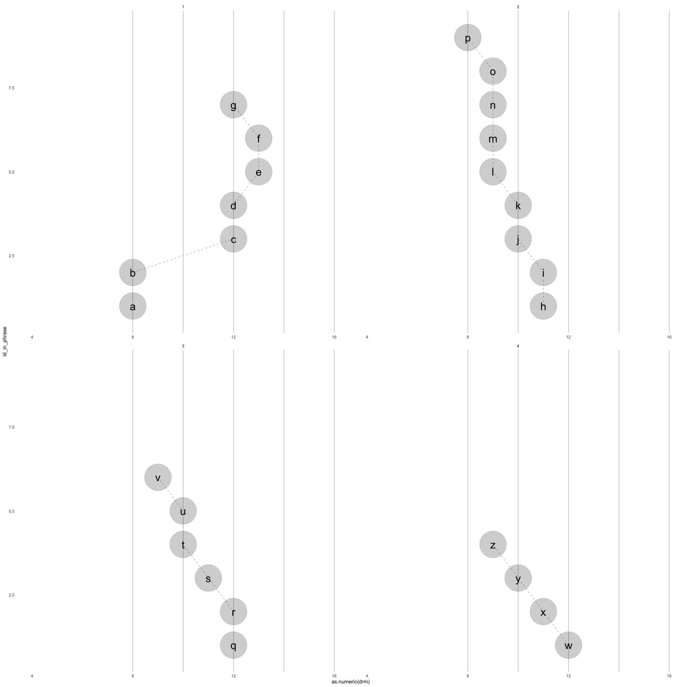

<!-- README.md is generated from README.Rmd. Please edit that file -->

# ggdoremi

Melodies can be input using short hand do re mi. Three octaves may be
input using the following short hand: DRMFSLTdrmfslt12345678.

This can be linked up with lyrics (modified if they span multiple notes)
and we’re thinking about durations.

“1ena2ena3ena4ena1nn3nn4nn5nn6nn7nn8nn9”

“1-23-45-67-8”

<!-- badges: start -->

<!-- badges: end -->

The goal of ggdoremi is to …

``` r

return_drm_3octaves <- function(){
  
drm3 <- c("D", "R", "M", "F", "S", "L", "T", 
  "d", "r", "m", "f", "s", "l", "t", 
  "1", "2", "3", "4", "5", "6", "7", "8")
    
factor(drm3, levels = drm3)
    
  
}

return_rel_freq_1octave <- function(){
  
  c(1, 9/8, 81/64,4/3, 3/2, 27/16, 243/128)
  
}

return_rel_freq_3octave <- function(){
  
  multiplier1octave <- return_rel_freq_1octave()
  
  c(multiplier1octave/2, multiplier1octave, multiplier1octave*2, 4)
  
}

return_drm_df <- function(base_freq = 440){  #A above middle C
  
  data.frame(drm = return_drm_3octaves(),
             doremi = c(rep(c("do", "re", "mi", "fa", "sol", "la", "ti"), 3), "do") %>% forcats::fct_inorder(),
             freq = base_freq*return_rel_freq_3octave())
  
}
```

``` r
return_drm_df()
#>    drm doremi      freq
#> 1    D     do  220.0000
#> 2    R     re  247.5000
#> 3    M     mi  278.4375
#> 4    F     fa  293.3333
#> 5    S    sol  330.0000
#> 6    L     la  371.2500
#> 7    T     ti  417.6562
#> 8    d     do  440.0000
#> 9    r     re  495.0000
#> 10   m     mi  556.8750
#> 11   f     fa  586.6667
#> 12   s    sol  660.0000
#> 13   l     la  742.5000
#> 14   t     ti  835.3125
#> 15   1     do  880.0000
#> 16   2     re  990.0000
#> 17   3     mi 1113.7500
#> 18   4     fa 1173.3333
#> 19   5    sol 1320.0000
#> 20   6     la 1485.0000
#> 21   7     ti 1670.6250
#> 22   8     do 1760.0000
```

``` r
return_phrases_lyrics_baby_beluga <- function(){
"Ba-by Be-lu-ga in the deep blue sea
Swim so wild and you swim so free,
heav-en ab-o-ove and the sea be-low,
just a lit-tle white whale on the go,
Ba-by Be-lu-ga,
Oh Ba-by Be-lu-ga,
Is the wa-ter warm, 
is your ma-ma home,
with you so hap-py"
}

return_phrases_drm_baby_beluga <- function(){
  
"mmrdSdrmmd mmsffmrr 
ffrTSTrfrT ssssfmrrd 
lfdlf lsmdsm 
rmfrm rmfrm rsfmr"
  
}

parse_phrases_drm <- function(drm_phrases = return_phrases_drm_baby_beluga(), base_freq = 440){
  
  levels <- return_drm_3octaves()
  
  drm_phrases <- strsplit(drm_phrases,  "\\s+")[[1]]
  
  data.frame(sung_notes = drm_phrases) |> 
  tibble::tibble() |> 
  dplyr::mutate(id_phrase = dplyr::row_number()) |> 
  dplyr::mutate(sung_notes_parsed = stringr::str_split(sung_notes, "")) |> 
  tidyr::unnest(cols = c(sung_notes_parsed)) |> 
  dplyr::mutate(sung_notes_parsed = factor(sung_notes_parsed, levels)) |> 
  dplyr::group_by(id_phrase) |> 
  dplyr::mutate(id_in_phrase = dplyr::row_number()) |>
  dplyr::select(id_phrase, id_in_phrase, drm = sung_notes_parsed) |> 
  dplyr::left_join(return_drm_df(base_freq = base_freq))
  
}

parse_phrases_lyrics <- function(lyrics_phrases){
  
    lyrics_phrases <- strsplit(lyrics_phrases,  "\\n")[[1]]
  
  tibble::tibble(words = lyrics_phrases) |> 
  dplyr::mutate(id_phrase = dplyr::row_number()) |> 
  dplyr::mutate(words_parsed = stringr::str_split(words, " |-")) |> 
  tidyr::unnest(cols = c(words_parsed)) |> 
  dplyr::group_by(id_phrase) |> 
  dplyr::mutate(id_in_phrase = dplyr::row_number()) |>
  dplyr::select(id_phrase, id_in_phrase, lyric = words_parsed)
  
}
```

``` r
return_phrases_drm_baby_beluga() |> 
  parse_phrases_drm()
#> Joining with `by = join_by(drm)`
#> # A tibble: 63 × 5
#> # Groups:   id_phrase [9]
#>    id_phrase id_in_phrase drm   doremi  freq
#>        <int>        <int> <fct> <fct>  <dbl>
#>  1         1            1 m     mi      557.
#>  2         1            2 m     mi      557.
#>  3         1            3 r     re      495 
#>  4         1            4 d     do      440 
#>  5         1            5 S     sol     330 
#>  6         1            6 d     do      440 
#>  7         1            7 r     re      495 
#>  8         1            8 m     mi      557.
#>  9         1            9 m     mi      557.
#> 10         1           10 d     do      440 
#> # ℹ 53 more rows

return_phrases_lyrics_baby_beluga() |> 
  parse_phrases_lyrics()
#> # A tibble: 64 × 3
#> # Groups:   id_phrase [9]
#>    id_phrase id_in_phrase lyric
#>        <int>        <int> <chr>
#>  1         1            1 Ba   
#>  2         1            2 by   
#>  3         1            3 Be   
#>  4         1            4 lu   
#>  5         1            5 ga   
#>  6         1            6 in   
#>  7         1            7 the  
#>  8         1            8 deep 
#>  9         1            9 blue 
#> 10         1           10 sea  
#> # ℹ 54 more rows
```

``` r
join_phrases_drm_lyrics <- function(drm_phrases = return_phrases_drm_baby_beluga(), 
                                    lyrics_phrases = return_phrases_lyrics_baby_beluga()){
 
  dplyr::full_join(parse_phrases_drm(drm_phrases),
                   parse_phrases_lyrics(lyrics_phrases))
  
}

return_df_drm_baby_beluga <- function(){
  
  
  join_phrases_drm_lyrics(
  drm_phrases = return_phrases_drm_baby_beluga(), 
  lyrics_phrases = return_phrases_lyrics_baby_beluga() 
  )
  
}
```

``` r
return_rhythm_baby_beluga <- function(){ 
      rhythm <- "12a3a4a12341234a123412a3a4a12a34a1a234a1234"
    measure <- "1111111222233333444455555556666666777778888"    
beat_in_measure  <- "12233441234123441234122334412a3441123441234"
ind_voiced      <- "1111111111011111111011111111011111111111000"
 
data.frame(rhythm, measure, beat_in_measure, ind_voiced)

  }

# time_span <- function(num_measures = 12){
#   
# measure <- c( "1" ,"e", "n", "a", "2", "e",
#  "n" ,"a", "3", "e", "n", "a",
#  "4" ,"e", "n", "a")
#   
# time_frame <- 1:(length(measure)*num_measures)
# 
# data.frame(time_frame,
# time_frame_element = rep(measure, num_measures))
# 
# }


# time_span() |> dplyr::bind_cols(data.frame(rythm=return_rythem_baby_beluga()))
```

``` r
join_phrases_drm_lyrics(
  drm_phrases = return_phrases_drm_baby_beluga(), 
  lyrics_phrases = return_phrases_lyrics_baby_beluga() 
  )
#> Joining with `by = join_by(drm)`
#> Joining with `by = join_by(id_phrase, id_in_phrase)`
#> # A tibble: 64 × 6
#> # Groups:   id_phrase [9]
#>    id_phrase id_in_phrase drm   doremi  freq lyric
#>        <int>        <int> <fct> <fct>  <dbl> <chr>
#>  1         1            1 m     mi      557. Ba   
#>  2         1            2 m     mi      557. by   
#>  3         1            3 r     re      495  Be   
#>  4         1            4 d     do      440  lu   
#>  5         1            5 S     sol     330  ga   
#>  6         1            6 d     do      440  in   
#>  7         1            7 r     re      495  the  
#>  8         1            8 m     mi      557. deep 
#>  9         1            9 m     mi      557. blue 
#> 10         1           10 d     do      440  sea  
#> # ℹ 54 more rows
```

``` r
aes_drm <- function(){
  
    ggplot2::aes(x = id_in_phrase, y = as.numeric(drm))
  
}


scale_xy_drm <- function(){
  
  list(ggplot2::scale_y_continuous(limits = c(4, 16)),
  ggplot2::scale_x_continuous(
    expand = ggplot2::expansion(mult = c(.1, .1))))
                                
}

facet_drm <- function(){
  
  facet_wrap(~ id_phrase, ncol = 2, scales = "free_x")
  
}


stamp_drm_staff <- function(){
  
    geom_hline(yintercept = c(8,10,12,14,16), color = "grey")
  
}

geom_note_link <- function(){
  
  geom_line(linetype = "dashed", color = "gray")
  
}


geom_note <- function(alpha = .2, size = 26, shape = 19, ...){
  
  ggplot2::geom_point(alpha = alpha, size = size, shape = shape, ...)
  
}

geom_lyric <- function(){
  
  ggplot2::geom_text(aes(label = lyric), size = 8)
  
  
}

geom_drm <- function(){
  
  ggplot2::geom_text(aes(label = drm), size = 8)
  
  
}


theme_drm <- function(){
  
  list(ggplot2::theme(legend.position = "none"),
  ggplot2::theme_minimal() ,
  ggplot2::theme(panel.grid = ggplot2::element_blank()))
  
}


drm2gg <- function(drm_df){
  
  drm_df |> 
  ggplot2::ggplot() + 
  aes_drm() + 
  stamp_drm_staff() +
  geom_note_link() +
  geom_note() + 
  geom_lyric() + 
  facet_drm() + 
  scale_xy_drm() + 
  theme_drm() 
  
}
```

``` r
library(tidyverse)
#> ── Attaching core tidyverse packages ─────────────────── tidyverse 2.0.0.9000 ──
#> ✔ dplyr     1.1.0          ✔ readr     2.1.4     
#> ✔ forcats   1.0.0          ✔ stringr   1.5.0     
#> ✔ ggplot2   3.4.4.9000     ✔ tibble    3.2.1     
#> ✔ lubridate 1.9.2          ✔ tidyr     1.3.0     
#> ✔ purrr     1.0.1          
#> ── Conflicts ────────────────────────────────────────── tidyverse_conflicts() ──
#> ✖ tidyr::extract()   masks magrittr::extract()
#> ✖ dplyr::filter()    masks stats::filter()
#> ✖ dplyr::lag()       masks stats::lag()
#> ✖ purrr::set_names() masks magrittr::set_names()
#> ℹ Use the conflicted package (<http://conflicted.r-lib.org/>) to force all conflicts to become errors
return_df_drm_baby_beluga() |> 
  ggplot() + 
  aes_drm() + 
  stamp_drm_staff() +
  geom_note_link() +
  geom_note() + 
  geom_lyric() + 
  facet_drm() + 
  scale_xy_drm() + 
  theme_drm() 
#> Joining with `by = join_by(drm)`
#> Joining with `by = join_by(id_phrase, id_in_phrase)`
#> Warning: Removed 1 row containing missing values or values outside the scale range
#> (`geom_point()`).
#> Warning: Removed 1 row containing missing values or values outside the scale range
#> (`geom_text()`).
```

<!-- -->

``` r

last_plot() + 
  coord_flip() + scale_x_reverse() +
  facet_wrap(~id_phrase, ncol = 3)
#> Scale for x is already present.
#> Adding another scale for x, which will replace the existing scale.
#> Warning: Removed 1 row containing missing values or values outside the scale range
#> (`geom_point()`).
#> Removed 1 row containing missing values or values outside the scale range
#> (`geom_text()`).
```

<!-- -->

``` r

ggwipe::last_plot_wipe_last() + 
  geom_drm()
#> Warning: Removed 1 row containing missing values or values outside the scale range
#> (`geom_point()`).
#> Removed 1 row containing missing values or values outside the scale range
#> (`geom_text()`).
```

<!-- -->

``` r
melody_twinkle <- "ddsslls ffmmrrd ssffmmr ssffmmr ddsslls ffmmrrd"

lyrics_twinkle <- "Twin-kle twin-kle lit-tle star
How I won-der what you are
Up a-bove the world so high 
Like a dia-mond in the sky 
Twin-kle twin-kle lit-tle star 
How I won-der what you are"
  
melody_twinkle |> 
  join_phrases_drm_lyrics(lyrics_twinkle) |> 
  ggplot() + 
  aes_drm() + 
  stamp_drm_staff() +
  geom_note_link() + 
  geom_note() + 
  facet_drm() + 
  geom_lyric() + 
  scale_xy_drm() 
#> Joining with `by = join_by(drm)`
#> Joining with `by = join_by(id_phrase, id_in_phrase)`
#> Warning: Removed 3 rows containing missing values or values outside the scale range
#> (`geom_point()`).
#> Warning: Removed 3 rows containing missing values or values outside the scale range
#> (`geom_text()`).
```

<!-- -->

``` r

ggwipe::last_plot_wipe_last() +
  theme_void() +
  geom_note(color = "black", fill = "white", shape = 21, alpha = 1)
#> Warning: Removed 3 rows containing missing values or values outside the scale range
#> (`geom_point()`).
#> Warning: Removed 3 rows containing missing values or values outside the scale range
#> (`geom_point()`).
```

<!-- -->

``` r

melodie_are_you_sleeping <- "drmd drmd mfs mfs slsfmr slsfmr dSd dSd"

lyrics_are_you_sleeping <- 
"Are you sleep-ing
Are you sleep-ing
Bro-ther John
Bro-ther John
Mor-ning bells are ring-ing
Mor-ning bells are ring-ing
Ding ding dong
Ding Ding Dong"


melodie_are_you_sleeping |> 
  join_phrases_drm_lyrics(lyrics_are_you_sleeping) |> 
  ggplot() + 
  aes_drm() + 
  stamp_drm_staff() +
  geom_note_link() + 
  geom_note() + 
  facet_drm() + 
  geom_lyric() + 
  scale_xy_drm() 
#> Joining with `by = join_by(drm)`
#> Joining with `by = join_by(id_phrase, id_in_phrase)`
```

<!-- -->

``` r

ggwipe::last_plot_wipe_last() +
  theme_void() +
  geom_note(color = "black", fill = "white", shape = 21, alpha = 1)
```

<!-- -->

``` r


lyrics_alphabet <- 
"a b c d e f g
h i j k l m n o p
q r s t u v
w x y z"

melody_alphabet <- "ddsslls ffmmrrrrd ssfmmr sfmr"


melody_alphabet |> 
  join_phrases_drm_lyrics(lyrics_alphabet) |> 
  ggplot() + 
  aes_drm() + 
  stamp_drm_staff() +
  geom_note_link() + 
  geom_note() + 
  facet_drm() + 
  geom_lyric() + 
  scale_xy_drm() + 
  coord_flip() + 
  theme_drm() 
#> Joining with `by = join_by(drm)`
#> Joining with `by = join_by(id_phrase, id_in_phrase)`
```

<!-- -->

``` r

# lyrics_twinkle_mandarin <- "萼 片 长"
melody_twinkle_mandarin <- "dds"

library(ggplot2)
theme <- theme_get()
#using the Chinese fonts you have, check it with font book.  
# theme$text$family <- "STFangsong"
theme_set(theme)

# melody_twinkle_mandarin |> 
#   join_phrases_drm_lyrics(lyrics_twinkle_mandarin) |> 
#   ggplot() + 
#   aes_drm() + 
#   stamp_drm_staff() +
#   geom_note_link() + 
#   geom_note() + 
#   facet_drm() + 
#   geom_lyric() + 
#   scale_xy_drm() + 
#   coord_flip()
```

``` r
drm_bus <- "Sdddddmsmd
rTSsmd
Sdddddmsmd
rSSd"

lyrics_bus <- "The peo-ple on the bus go up and down
up and down up and down
The peo-ple on the bus go up and down
All through the town"


drm_bus |> 
  join_phrases_drm_lyrics(lyrics_bus) |> 
  ggplot() + 
  aes_drm() + 
  stamp_drm_staff() +
  geom_note_link() + 
  geom_note() + 
  facet_drm() + 
  geom_lyric() + 
  scale_xy_drm() + 
  # coord_flip() + 
  theme_drm() 
#> Joining with `by = join_by(drm)`
#> Joining with `by = join_by(id_phrase, id_in_phrase)`
```

<!-- -->

# imagination

``` r
drm_imagination <- "LdsLds
Ldt1t1t1ts
Ldmfsm
rdTdTdTS"

lyrics_imagination <-"Come with me and you'll be
In a world of pure im-a-gi-na-tion
Take a look and you'll see
In-to your im-a-gi-na-tion"

drm_imagination |> 
  join_phrases_drm_lyrics(lyrics_imagination) |> 
  ggplot() + 
  aes_drm() + 
  stamp_drm_staff() +
  geom_note_link() + 
  geom_note() + 
  facet_drm() + 
  geom_lyric() + 
  scale_xy_drm() + 
  # coord_flip() + 
  theme_drm() +
  aes(color = doremi %>% fct_rev())
#> Joining with `by = join_by(drm)`
#> Joining with `by = join_by(id_phrase, id_in_phrase)`
```

<!-- -->

``` r
knitr::knit_code$get() |> names()
#>  [1] "unnamed-chunk-1"           "scale_reference"          
#>  [3] "unnamed-chunk-2"           "phrase_parsing"           
#>  [5] "unnamed-chunk-3"           "join_phrases_drm_lyrics"  
#>  [7] "return_rhythm_baby_beluga" "unnamed-chunk-4"          
#>  [9] "drm2gg"                    "unnamed-chunk-5"          
#> [11] "unnamed-chunk-6"           "unnamed-chunk-7"          
#> [13] "unnamed-chunk-8"           "unnamed-chunk-9"          
#> [15] "unnamed-chunk-10"          "unnamed-chunk-11"
```

``` r
readme2pkg::chunk_to_r(c("scale_reference",
                         "phrase_parsing",
                         "join_phrases_drm_lyrics",
                         "return_rhythm_baby_beluga",
                         "drm2gg"))
```

``` r
devtools::check(".")
#> ══ Documenting ═════════════════════════════════════════════════════════════════
#> ℹ Updating ggdoremi documentation
#> ℹ Loading ggdoremi
#> 
#> ══ Building ════════════════════════════════════════════════════════════════════
#> Setting env vars:
#> • CFLAGS    : -Wall -pedantic
#> • CXXFLAGS  : -Wall -pedantic
#> • CXX11FLAGS: -Wall -pedantic
#> • CXX14FLAGS: -Wall -pedantic
#> • CXX17FLAGS: -Wall -pedantic
#> • CXX20FLAGS: -Wall -pedantic
#> ── R CMD build ─────────────────────────────────────────────────────────────────
#> * checking for file ‘/Users/evangelinereynolds/Google Drive/r_packages/ggdoremi/DESCRIPTION’ ... OK
#> * preparing ‘ggdoremi’:
#> * checking DESCRIPTION meta-information ... OK
#> * checking for LF line-endings in source and make files and shell scripts
#> * checking for empty or unneeded directories
#> Removed empty directory ‘ggdoremi/man’
#> * building ‘ggdoremi_0.0.0.9000.tar.gz’
#> 
#> ══ Checking ════════════════════════════════════════════════════════════════════
#> Setting env vars:
#> • _R_CHECK_CRAN_INCOMING_REMOTE_               : FALSE
#> • _R_CHECK_CRAN_INCOMING_                      : FALSE
#> • _R_CHECK_FORCE_SUGGESTS_                     : FALSE
#> • _R_CHECK_PACKAGES_USED_IGNORE_UNUSED_IMPORTS_: FALSE
#> • NOT_CRAN                                     : true
#> ── R CMD check ─────────────────────────────────────────────────────────────────
#> * using log directory ‘/private/var/folders/zy/vfmj60bs3zv6r_2dsk18_vj00000gn/T/Rtmpe1aunO/file116965fad5f24/ggdoremi.Rcheck’
#> * using R version 4.2.2 (2022-10-31)
#> * using platform: x86_64-apple-darwin17.0 (64-bit)
#> * using session charset: UTF-8
#> * using options ‘--no-manual --as-cran’
#> * checking for file ‘ggdoremi/DESCRIPTION’ ... OK
#> * this is package ‘ggdoremi’ version ‘0.0.0.9000’
#> * package encoding: UTF-8
#> * checking package namespace information ... OK
#> * checking package dependencies ... OK
#> * checking if this is a source package ... OK
#> * checking if there is a namespace ... OK
#> * checking for executable files ... OK
#> * checking for hidden files and directories ... OK
#> * checking for portable file names ... OK
#> * checking for sufficient/correct file permissions ... OK
#> * checking serialization versions ... OK
#> * checking whether package ‘ggdoremi’ can be installed ... OK
#> * checking installed package size ... OK
#> * checking package directory ... OK
#> * checking for future file timestamps ... OK
#> * checking DESCRIPTION meta-information ... WARNING
#> Non-standard license specification:
#>   `use_mit_license()`, `use_gpl3_license()` or friends to pick a
#>   license
#> Standardizable: FALSE
#> * checking top-level files ... NOTE
#> Non-standard files/directories found at top level:
#>   ‘README.Rmd’ ‘README_files’
#> * checking for left-over files ... OK
#> * checking index information ... OK
#> * checking package subdirectories ... OK
#> * checking R files for non-ASCII characters ... OK
#> * checking R files for syntax errors ... OK
#> * checking whether the package can be loaded ... OK
#> * checking whether the package can be loaded with stated dependencies ... OK
#> * checking whether the package can be unloaded cleanly ... OK
#> * checking whether the namespace can be loaded with stated dependencies ... OK
#> * checking whether the namespace can be unloaded cleanly ... OK
#> * checking loading without being on the library search path ... OK
#> * checking dependencies in R code ... WARNING
#> '::' or ':::' imports not declared from:
#>   ‘dplyr’ ‘forcats’ ‘ggplot2’ ‘stringr’ ‘tibble’ ‘tidyr’
#> * checking S3 generic/method consistency ... OK
#> * checking replacement functions ... OK
#> * checking foreign function calls ... OK
#> * checking R code for possible problems ... NOTE
#> aes_drm: no visible binding for global variable ‘id_in_phrase’
#> aes_drm: no visible binding for global variable ‘drm’
#> facet_drm: no visible global function definition for ‘facet_wrap’
#> geom_drm: no visible global function definition for ‘aes’
#> geom_drm: no visible binding for global variable ‘drm’
#> geom_lyric: no visible global function definition for ‘aes’
#> geom_lyric: no visible binding for global variable ‘lyric’
#> geom_note_link: no visible global function definition for ‘geom_line’
#> parse_phrases_drm: no visible binding for global variable ‘sung_notes’
#> parse_phrases_drm: no visible binding for global variable
#>   ‘sung_notes_parsed’
#> parse_phrases_drm: no visible binding for global variable ‘id_phrase’
#> parse_phrases_drm: no visible binding for global variable
#>   ‘id_in_phrase’
#> parse_phrases_lyrics: no visible binding for global variable ‘words’
#> parse_phrases_lyrics: no visible binding for global variable
#>   ‘words_parsed’
#> parse_phrases_lyrics: no visible binding for global variable
#>   ‘id_phrase’
#> parse_phrases_lyrics: no visible binding for global variable
#>   ‘id_in_phrase’
#> return_drm_df: no visible global function definition for ‘%>%’
#> stamp_drm_staff: no visible global function definition for ‘geom_hline’
#> Undefined global functions or variables:
#>   %>% aes drm facet_wrap geom_hline geom_line id_in_phrase id_phrase
#>   lyric sung_notes sung_notes_parsed words words_parsed
#> * checking for missing documentation entries ... OK
#> * checking examples ... NONE
#> * checking for non-standard things in the check directory ... OK
#> * checking for detritus in the temp directory ... OK
#> * DONE
#> 
#> Status: 2 WARNINGs, 2 NOTEs
#> See
#>   ‘/private/var/folders/zy/vfmj60bs3zv6r_2dsk18_vj00000gn/T/Rtmpe1aunO/file116965fad5f24/ggdoremi.Rcheck/00check.log’
#> for details.
#> ── R CMD check results ──────────────────────────────── ggdoremi 0.0.0.9000 ────
#> Duration: 25.9s
#> 
#> ❯ checking DESCRIPTION meta-information ... WARNING
#>   Non-standard license specification:
#>     `use_mit_license()`, `use_gpl3_license()` or friends to pick a
#>     license
#>   Standardizable: FALSE
#> 
#> ❯ checking dependencies in R code ... WARNING
#>   '::' or ':::' imports not declared from:
#>     ‘dplyr’ ‘forcats’ ‘ggplot2’ ‘stringr’ ‘tibble’ ‘tidyr’
#> 
#> ❯ checking top-level files ... NOTE
#>   Non-standard files/directories found at top level:
#>     ‘README.Rmd’ ‘README_files’
#> 
#> ❯ checking R code for possible problems ... NOTE
#>   aes_drm: no visible binding for global variable ‘id_in_phrase’
#>   aes_drm: no visible binding for global variable ‘drm’
#>   facet_drm: no visible global function definition for ‘facet_wrap’
#>   geom_drm: no visible global function definition for ‘aes’
#>   geom_drm: no visible binding for global variable ‘drm’
#>   geom_lyric: no visible global function definition for ‘aes’
#>   geom_lyric: no visible binding for global variable ‘lyric’
#>   geom_note_link: no visible global function definition for ‘geom_line’
#>   parse_phrases_drm: no visible binding for global variable ‘sung_notes’
#>   parse_phrases_drm: no visible binding for global variable
#>     ‘sung_notes_parsed’
#>   parse_phrases_drm: no visible binding for global variable ‘id_phrase’
#>   parse_phrases_drm: no visible binding for global variable
#>     ‘id_in_phrase’
#>   parse_phrases_lyrics: no visible binding for global variable ‘words’
#>   parse_phrases_lyrics: no visible binding for global variable
#>     ‘words_parsed’
#>   parse_phrases_lyrics: no visible binding for global variable
#>     ‘id_phrase’
#>   parse_phrases_lyrics: no visible binding for global variable
#>     ‘id_in_phrase’
#>   return_drm_df: no visible global function definition for ‘%>%’
#>   stamp_drm_staff: no visible global function definition for ‘geom_hline’
#>   Undefined global functions or variables:
#>     %>% aes drm facet_wrap geom_hline geom_line id_in_phrase id_phrase
#>     lyric sung_notes sung_notes_parsed words words_parsed
#> 
#> 0 errors ✔ | 2 warnings ✖ | 2 notes ✖
#> Error: R CMD check found WARNINGs
```
