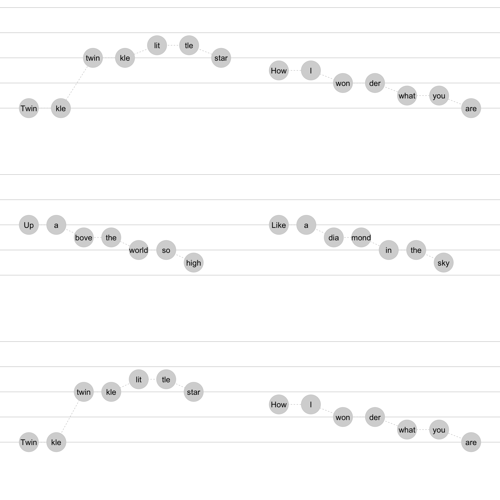

<!-- README.md is generated from README.Rmd. Please edit that file -->

# ggdoremi

Melodies can be input using short hand do re mi. Three octaves may be
input using the following short hand: DRMFSLTdrmfslt12345678.

This can be linked up with lyrics (modified if they span multiple notes)
and we’re thinking about durations.

“1ena2ena3ena4ena1nn3nn4nn5nn6nn7nn8nn9”

“1-23-45-67-8”

<!-- badges: start -->

<!-- badges: end -->

The goal of ggdoremi is to …

``` r

return_drm_3octaves <- function(){
  
drm3 <- c("D", "R", "M", "F", "S", "L", "T", 
  "d", "r", "m", "f", "s", "l", "t", 
  "1", "2", "3", "4", "5", "6", "7", "8")
    
factor(drm3, levels = drm3)
    
  
}

return_rel_freq_1octave <- function(){
  
  c(1, 9/8, 81/64,4/3, 3/2, 27/16, 243/128)
  
}

return_rel_freq_3octave <- function(){
  
  multiplier1octave <- return_rel_freq_1octave()
  
  c(multiplier1octave/2, multiplier1octave, multiplier1octave*2, 4)
  
}

return_drm_df <- function(base_freq = 440){  #A above middle C
  
  data.frame(drm = return_drm_3octaves(),
             doremi = c(rep(c("do", "re", "mi", "fa", "sol", "la", "ti"), 3), "do"),
             freq = base_freq*return_rel_freq_3octave())
  
}
```

``` r
return_drm_df()
#>    drm doremi      freq
#> 1    D     do  220.0000
#> 2    R     re  247.5000
#> 3    M     mi  278.4375
#> 4    F     fa  293.3333
#> 5    S    sol  330.0000
#> 6    L     la  371.2500
#> 7    T     ti  417.6562
#> 8    d     do  440.0000
#> 9    r     re  495.0000
#> 10   m     mi  556.8750
#> 11   f     fa  586.6667
#> 12   s    sol  660.0000
#> 13   l     la  742.5000
#> 14   t     ti  835.3125
#> 15   1     do  880.0000
#> 16   2     re  990.0000
#> 17   3     mi 1113.7500
#> 18   4     fa 1173.3333
#> 19   5    sol 1320.0000
#> 20   6     la 1485.0000
#> 21   7     ti 1670.6250
#> 22   8     do 1760.0000
```

``` r
return_phrases_lyrics_baby_beluga <- function(){
c("Ba-by Be-lu-ga in the deep blue sea",
  "Swim so wild and you swim so free",
  "heav-en ab-o-ove and the sea be-low",
  "just a lit-tle white whale on the go",
  "Ba-by Be-lu-ga",
  "Oh Ba-by Be-lu-ga",
  "Is the wa-ter warm", 
  "is your ma-ma home",
  "with you so hap-py") 
}

return_phrases_drm_baby_beluga <- function(){
  
  c("mmrdSdrmmd",
"mmsffmrr",
"ffrTSTrfrT",
"ssssfmrrd",
"lfdlf",
"lsmdsm",
"rmfrm", # this might actually have an accidental.
"rmfrm",
"rsfmr")
  
}


return_rythem_baby_beluga <- function(){ "12a3a4a123-41234a123-412a3a4a12a341n2n341-2-3-4"}

parse_phrases_drm <- function(drm_phrases, base_freq = 440){
  
  levels <- return_drm_3octaves()
  
  data.frame(sung_notes = drm_phrases) |> 
  tibble::tibble() |> 
  dplyr::mutate(id_phrase = dplyr::row_number()) |> 
  dplyr::mutate(sung_notes_parsed = stringr::str_split(sung_notes, "")) |> 
  tidyr::unnest(cols = c(sung_notes_parsed)) |> 
  dplyr::mutate(sung_notes_parsed = factor(sung_notes_parsed, levels)) |> 
  dplyr::group_by(id_phrase) |> 
  dplyr::mutate(id_in_phrase = dplyr::row_number()) |>
  dplyr::select(id_phrase, id_in_phrase, drm = sung_notes_parsed) |> 
  dplyr::left_join(return_drm_df(base_freq = base_freq))
  
}

parse_phrases_lyrics <- function(lyrics_phrases){
  
  tibble::tibble(words = lyrics_phrases) |> 
  dplyr::mutate(id_phrase = dplyr::row_number()) |> 
  dplyr::mutate(words_parsed = stringr::str_split(words, " |-")) |> 
  tidyr::unnest(cols = c(words_parsed)) |> 
  dplyr::group_by(id_phrase) |> 
  dplyr::mutate(id_in_phrase = dplyr::row_number()) |>
  dplyr::select(id_phrase, id_in_phrase, lyric = words_parsed)
  
}
```

``` r
return_phrases_drm_baby_beluga() |> 
  parse_phrases_drm()
#> Joining with `by = join_by(drm)`
#> # A tibble: 63 × 5
#> # Groups:   id_phrase [9]
#>    id_phrase id_in_phrase drm   doremi  freq
#>        <int>        <int> <fct> <chr>  <dbl>
#>  1         1            1 m     mi      557.
#>  2         1            2 m     mi      557.
#>  3         1            3 r     re      495 
#>  4         1            4 d     do      440 
#>  5         1            5 S     sol     330 
#>  6         1            6 d     do      440 
#>  7         1            7 r     re      495 
#>  8         1            8 m     mi      557.
#>  9         1            9 m     mi      557.
#> 10         1           10 d     do      440 
#> # ℹ 53 more rows

return_phrases_lyrics_baby_beluga() |> 
  parse_phrases_lyrics()
#> # A tibble: 63 × 3
#> # Groups:   id_phrase [9]
#>    id_phrase id_in_phrase lyric
#>        <int>        <int> <chr>
#>  1         1            1 Ba   
#>  2         1            2 by   
#>  3         1            3 Be   
#>  4         1            4 lu   
#>  5         1            5 ga   
#>  6         1            6 in   
#>  7         1            7 the  
#>  8         1            8 deep 
#>  9         1            9 blue 
#> 10         1           10 sea  
#> # ℹ 53 more rows
```

``` r
join_phrases_drm_lyrics <- function(drm_phrases = return_phrases_drm_baby_beluga(), 
                                    lyrics_phrases = return_phrases_lyrics_baby_beluga()){
 
  dplyr::full_join(parse_phrases_drm(drm_phrases),
                   parse_phrases_lyrics(lyrics_phrases))
  
}

return_df_drm_baby_beluga <- function(){
  
  
  join_phrases_drm_lyrics(
  drm_phrases = return_phrases_drm_baby_beluga(), 
  lyrics_phrases = return_phrases_lyrics_baby_beluga() 
  )
  
}
```

``` r
join_phrases_drm_lyrics(
  drm_phrases = return_phrases_drm_baby_beluga(), 
  lyrics_phrases = return_phrases_lyrics_baby_beluga() 
  )
#> Joining with `by = join_by(drm)`
#> Joining with `by = join_by(id_phrase, id_in_phrase)`
#> # A tibble: 63 × 6
#> # Groups:   id_phrase [9]
#>    id_phrase id_in_phrase drm   doremi  freq lyric
#>        <int>        <int> <fct> <chr>  <dbl> <chr>
#>  1         1            1 m     mi      557. Ba   
#>  2         1            2 m     mi      557. by   
#>  3         1            3 r     re      495  Be   
#>  4         1            4 d     do      440  lu   
#>  5         1            5 S     sol     330  ga   
#>  6         1            6 d     do      440  in   
#>  7         1            7 r     re      495  the  
#>  8         1            8 m     mi      557. deep 
#>  9         1            9 m     mi      557. blue 
#> 10         1           10 d     do      440  sea  
#> # ℹ 53 more rows
```

``` r
library(tidyverse)
#> ── Attaching core tidyverse packages ─────────────────── tidyverse 2.0.0.9000 ──
#> ✔ dplyr     1.1.0     ✔ readr     2.1.4
#> ✔ forcats   1.0.0     ✔ stringr   1.5.0
#> ✔ ggplot2   3.4.4     ✔ tibble    3.2.1
#> ✔ lubridate 1.9.2     ✔ tidyr     1.3.0
#> ✔ purrr     1.0.1     
#> ── Conflicts ────────────────────────────────────────── tidyverse_conflicts() ──
#> ✖ dplyr::filter() masks stats::filter()
#> ✖ dplyr::lag()    masks stats::lag()
#> ℹ Use the conflicted package (<http://conflicted.r-lib.org/>) to force all conflicts to become errors

aes_drm <- function(){
  
    aes(x = id_in_phrase, y = as.numeric(drm))
  
}


scale_xy_drm <- function(){
  
  list(scale_y_continuous(limits = c(4, 16)),
  scale_x_continuous(expand = expansion(mult = c(.1, .1))))
                                
}

facet_drm <- function(){
  
  facet_wrap(~ id_phrase, ncol = 2, scales = "free_x")
  
}


stamp_drm_staff <- function(){
  
    geom_hline(yintercept = c(8,10,12,14,16), color = "grey")
  
}

geom_note_link <- function(){
  
  geom_line(linetype = "dashed", color = "gray")
  
}


geom_note <- function(){
  
  geom_point(alpha = .2, size = 26, shape = 19)
  
}

geom_lyric <- function(){
  
  geom_text(aes(label = lyric), size = 8)
  
  
}

geom_drm <- function(){
  
  geom_text(aes(label = drm), size = 8)
  
  
}


theme_drm <- function(){
  
  list(theme(legend.position = "none"),
  theme_minimal() ,
  theme(panel.grid = element_blank()))
  
}
```

``` r
return_df_drm_baby_beluga() |> 
  ggplot() + 
  aes_drm() + 
  stamp_drm_staff() +
  geom_note_link() +
  geom_note() + 
  geom_lyric() + 
  facet_drm() + 
  scale_xy_drm() + 
  theme_drm() 
#> Joining with `by = join_by(drm)`
#> Joining with `by = join_by(id_phrase, id_in_phrase)`
```

<!-- -->

``` r

last_plot() + 
  coord_flip() + scale_x_reverse() +
  facet_wrap(~id_phrase, ncol = 3)
#> Scale for x is already present.
#> Adding another scale for x, which will replace the existing scale.
```

<!-- -->

``` r

ggwipe::last_plot_wipe_last() + 
  geom_drm()
```

<!-- -->

``` r
melody_twinkle <- c("ddsslls",
"ffmmrrd",
"ssffmmr",
"ssffmmr",
"ddsslls",
"ffmmrrd")

lyrics_twinkle <- c(
  
  "Twin-kle twin-kle lit-tle star",
  "How I won-der what you are",
  "Up a-bove the world so high, ",
  "Like a dia-mond in the sky. ",
  "Twin-kle twin-kle lit-tle star, ",
  "How I won-der what you are"
  
  
)

melody_twinkle |> 
  join_phrases_drm_lyrics(lyrics_twinkle) |> 
  ggplot() + 
  aes_drm() + 
  stamp_drm_staff() +
  geom_note_link() + 
  geom_note() + 
  facet_drm() + 
  geom_lyric() + 
  scale_xy_drm()
#> Joining with `by = join_by(drm)`
#> Joining with `by = join_by(id_phrase, id_in_phrase)`
#> Warning: Removed 3 rows containing missing values (`geom_point()`).
#> Warning: Removed 3 rows containing missing values (`geom_text()`).
```

<!-- -->
