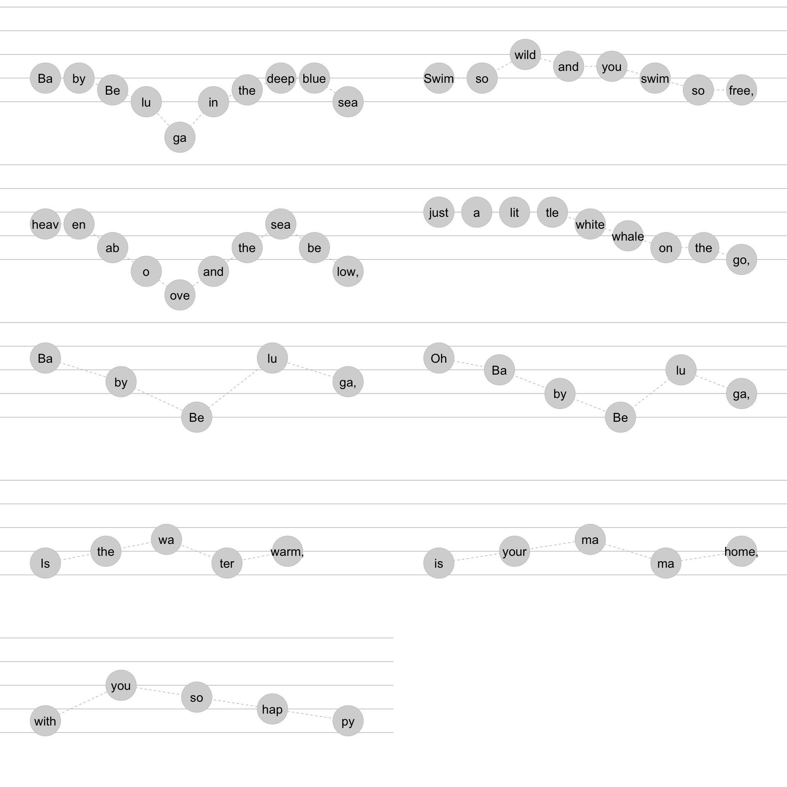

<!-- README.md is generated from README.Rmd. Please edit that file -->

# ggdoremi

Melodies can be input using short hand do re mi. Three octaves may be
input using the following short hand: DRMFSLTdrmfslt12345678.

This can be linked up with lyrics (modified if they span multiple notes)
and we’re thinking about durations.

“1ena2ena3ena4ena1nn3nn4nn5nn6nn7nn8nn9”

“1-23-45-67-8”

<!-- badges: start -->

<!-- badges: end -->

The goal of ggdoremi is to …

``` r


return_phrases_lyrics_baby_beluga <- function(){
c("Ba-by Be-lu-ga in the deep blue sea",
  "Swim so wild and you swim so free",
  "heav-en ab-o-ove and the sea be-low",
  "just a lit-tle white whale on the go",
  "Ba-by Be-lu-ga",
  "Oh Ba-by Be-lu-ga",
  "Is the wa-ter warm", 
  "is your ma-ma home",
  "with you so hap-py") 
}

return_phrases_drm_baby_beluga <- function(){
  
  c("mmrdSdrmmd",
"mmsffmrr",
"ffrTSTrfrT",
"ssssfmrrd",
"lfdlf",
"smdsm",
"rmfrm", # this might actually have an accidental.
"rmfrm",
"rsfmr")
  
}

return_rythem_baby_beluga <- function(){ "12a3a4a123-41234a123-412a3a4a12a341n2n341-2-3-4"}

parse_phrases_drm <- function(drm_phrases){
  
  levels <- stringr::str_split("DRMFSLTdrmfslt12345678", "")[[1]]
  
  data.frame(sung_notes = drm_phrases) |> 
  tibble::tibble() |> 
  dplyr::mutate(id_phrase = dplyr::row_number()) |> 
  dplyr::mutate(sung_notes_parsed = stringr::str_split(sung_notes, "")) |> 
  tidyr::unnest(cols = c(sung_notes_parsed)) |> 
  dplyr::mutate(sung_notes_parsed = factor(sung_notes_parsed, levels)) |> 
  dplyr::group_by(id_phrase) |> 
  dplyr::mutate(id_in_phrase = dplyr::row_number()) |>
  dplyr::select(id_phrase, id_in_phrase, drm = sung_notes_parsed)
  
}

parse_phrases_lyrics <- function(lyrics_phrases){
  
  tibble::tibble(words = lyrics_phrases) |> 
  dplyr::mutate(id_phrase = dplyr::row_number()) |> 
  dplyr::mutate(words_parsed = stringr::str_split(words, " |-")) |> 
  tidyr::unnest(cols = c(words_parsed)) |> 
  dplyr::group_by(id_phrase) |> 
  dplyr::mutate(id_in_phrase = dplyr::row_number()) |>
  dplyr::select(id_phrase, id_in_phrase, lyric = words_parsed)
  
}
```

``` r
return_phrases_lyrics_baby_beluga() |> 
  parse_phrases_lyrics()
#> # A tibble: 63 × 3
#> # Groups:   id_phrase [9]
#>    id_phrase id_in_phrase lyric
#>        <int>        <int> <chr>
#>  1         1            1 Ba   
#>  2         1            2 by   
#>  3         1            3 Be   
#>  4         1            4 lu   
#>  5         1            5 ga   
#>  6         1            6 in   
#>  7         1            7 the  
#>  8         1            8 deep 
#>  9         1            9 blue 
#> 10         1           10 sea  
#> # ℹ 53 more rows
  
return_phrases_drm_baby_beluga() |> 
  parse_phrases_drm()
#> # A tibble: 62 × 3
#> # Groups:   id_phrase [9]
#>    id_phrase id_in_phrase drm  
#>        <int>        <int> <fct>
#>  1         1            1 m    
#>  2         1            2 m    
#>  3         1            3 r    
#>  4         1            4 d    
#>  5         1            5 S    
#>  6         1            6 d    
#>  7         1            7 r    
#>  8         1            8 m    
#>  9         1            9 m    
#> 10         1           10 d    
#> # ℹ 52 more rows
```

``` r
join_phrases_drm_lyrics <- function(drm_phrases = return_phrases_drm_baby_beluga(), 
                                    lyrics_phrases = return_phrases_lyrics_baby_beluga()){
 
  dplyr::full_join(parse_phrases_drm(drm_phrases),
                   parse_phrases_lyrics(lyrics_phrases))
  
}

return_df_drm_baby_beluga <- function(){
  
  
  join_phrases_drm_lyrics(
  drm_phrases = return_phrases_drm_baby_beluga(), 
  lyrics_phrases = return_phrases_lyrics_baby_beluga() 
  )
  
}
```

``` r
join_phrases_drm_lyrics(
  drm_phrases = return_phrases_drm_baby_beluga(), 
  lyrics_phrases = return_phrases_lyrics_baby_beluga() 
  )
#> Joining with `by = join_by(id_phrase, id_in_phrase)`
#> # A tibble: 63 × 4
#> # Groups:   id_phrase [9]
#>    id_phrase id_in_phrase drm   lyric
#>        <int>        <int> <fct> <chr>
#>  1         1            1 m     Ba   
#>  2         1            2 m     by   
#>  3         1            3 r     Be   
#>  4         1            4 d     lu   
#>  5         1            5 S     ga   
#>  6         1            6 d     in   
#>  7         1            7 r     the  
#>  8         1            8 m     deep 
#>  9         1            9 m     blue 
#> 10         1           10 d     sea  
#> # ℹ 53 more rows
```

``` r
library(tidyverse)
#> ── Attaching core tidyverse packages ─────────────────── tidyverse 2.0.0.9000 ──
#> ✔ dplyr     1.1.0     ✔ readr     2.1.4
#> ✔ forcats   1.0.0     ✔ stringr   1.5.0
#> ✔ ggplot2   3.4.4     ✔ tibble    3.2.1
#> ✔ lubridate 1.9.2     ✔ tidyr     1.3.0
#> ✔ purrr     1.0.1     
#> ── Conflicts ────────────────────────────────────────── tidyverse_conflicts() ──
#> ✖ dplyr::filter() masks stats::filter()
#> ✖ dplyr::lag()    masks stats::lag()
#> ℹ Use the conflicted package (<http://conflicted.r-lib.org/>) to force all conflicts to become errors

aes_drm <- function(){
  
    aes(x = id_in_phrase, y = as.numeric(drm))
  
}


scale_xy_drm <- function(){
  
  list(scale_y_continuous(limits = c(4, 16)),
  scale_x_continuous(expand = expansion(mult = c(.1, .1))))
                                
}

facet_drm <- function(){
  
  facet_wrap(~ id_phrase, ncol = 2, scales = "free_x")
  
}


stamp_drm_staff <- function(){
  
    geom_hline(yintercept = c(8,10,12,14,16), color = "grey")
  
}


geom_note <- function(){
  
  geom_point(alpha = .2, size = 26, shape = 19)
  
}

geom_lyric <- function(){
  
  geom_text(aes(label = lyric), size = 8)
  
  
}

geom_drm <- function(){
  
  geom_text(aes(label = drm), size = 8)
  
  
}


theme_drm <- function(){
  
  list(theme(legend.position = "none"),
  theme_minimal() ,
  theme(panel.grid = element_blank()))
  
}
```

``` r
return_df_drm_baby_beluga() |> 
  ggplot() + 
  aes_drm() + 
  stamp_drm_staff() +
  geom_note() + 
  geom_lyric() + 
  facet_drm() + 
  scale_xy_drm() + 
  theme_drm() 
#> Joining with `by = join_by(id_phrase, id_in_phrase)`
#> Warning: Removed 1 rows containing missing values (`geom_point()`).
#> Warning: Removed 1 rows containing missing values (`geom_text()`).
```

<!-- -->

``` r

ggwipe::last_plot_wipe_last() + 
  geom_drm()
#> Warning: Removed 1 rows containing missing values (`geom_point()`).
#> Removed 1 rows containing missing values (`geom_text()`).
```

<!-- -->
